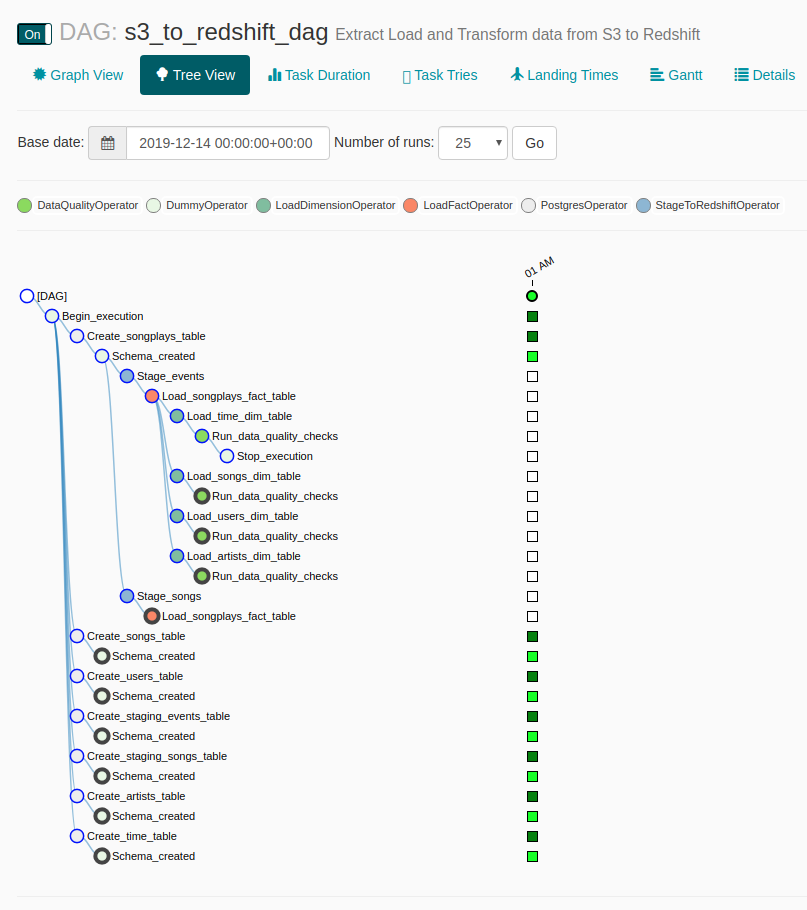

# Data Pipeline Airflow
## Introduction
A music streaming company, Sparkify, has decided that it is time to introduce more automation and monitoring to their data warehouse ETL pipelines and come to the conclusion that the best tool to achieve this is Apache Airflow.

The source data resides in S3 and needs to be processed in Sparkify's data warehouse in Amazon Redshift. The source datasets consist of JSON logs that tell about user activity in the application and JSON metadata about the songs the users listen to.

### Project structure explanation
```
airflow-data-pipeline
│   README.md                    # Project description   
│   requirements.txt             # Python dependencies
|   dag.png                      # Pipeline DAG image
│   
└───airflow                      # Airflow home
|   |               
│   └───dags                     # Jupyter notebooks
│   |   │ s3_to_redshift_dag.py  # DAG definition
|   |   |
|   └───plugins
│       │  
|       └───helpers
|       |   | sql_queries.py     # All sql queries needed
|       |
|       └───operators
|       |   | data_quality.py    # DataQualityOperator
|       |   | load_dimension.py  # LoadDimensionOperator
|       |   | load_fact.py       # LoadFactOperator
|       |   | stage_redshift.py  # StageToRedshiftOperator
```
#### Start the DAG
Start the DAG by switching it state from OFF to ON.

Refresh the page and click on the s3_to_redshift_dag to view the current state.

The whole pipeline should take around 10 minutes to complete.



